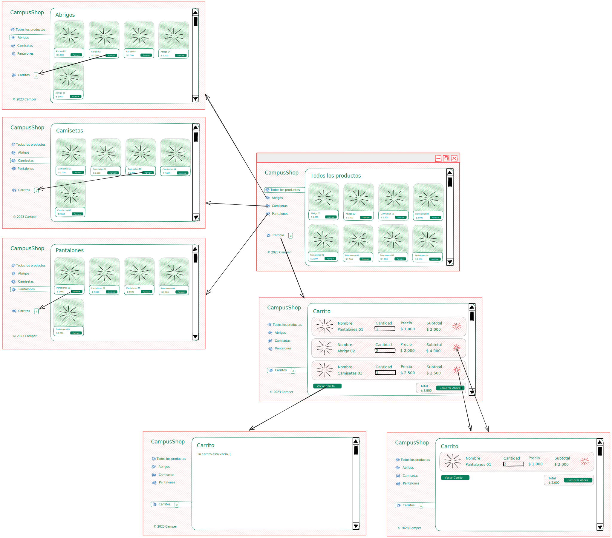
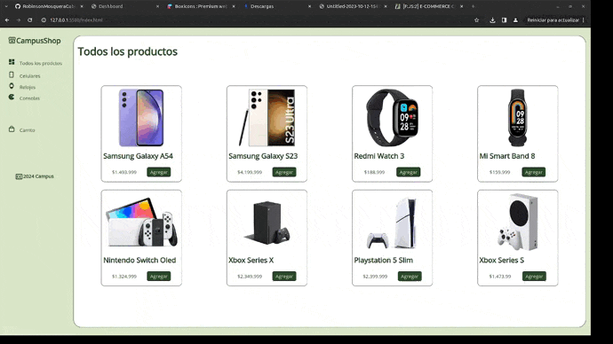

# E-COMMERCE CAMPUSSHOP

Un desarrollador Full-Stack es solicitado en hacer la continuación del proyecto de desarrollo de un Aplicativo Web que pueda gestionar la compra y venta de productos del E-Commerce “CampusShop”. Para ello se entrega un proyecto base realizado, el cual contiene una ejemplificación funcional a nivel frontal y un servicio trasero el cual proveerá la información necesaria para el uso de .

El propósito de dicho trabajo es realizar la creación de la parte frontal del aplicativo de acuerdo a los requerimientos del cliente.

## Descripcion de la construccion

Para construir esta pagina web se utilizo Html5 y Css3 combinando los metodos de grid y flex, tambien se crearon varios archivos html para un mejor manejo de los mismos.
Los archivos creados fueron:

#### index.html:

este contiene la categoria de todos los productos, en este archivo se uso flex para el menu y grid para acomodar los productos.

#### cel.html:

este contiene la categoria de celulares, en este archivo se uso flex para el menu y grid para acomodar los productos.

#### rel.html:

este contiene la categoria de relojes, en este archivo se uso flex para el menu y grid para acomodar los productos.

#### con.html:

este contiene la categoria de consolas, en este archivo se uso flex para el menu y grid para acomodar los productos.

#### com.html:

este contiene la categoria del "carrito", en este archivo se uso 100% flex

#### comVacio.html:

este contiene la version del carrito, en este archivo se uso flex para el menu y grid para acomodar los productos.

#### show1.html, show2.html, show3.html:

para acceder a este html es dando click al boton simbolizado con un ojo y muestra el producto de manera individual, en este archivo se uso flex para el menu y grid para acomodar los productos.

## Estandares

##### Tipo de fuente:

open sans

##### Colores

white

\#294B29

\#DBE7C9

